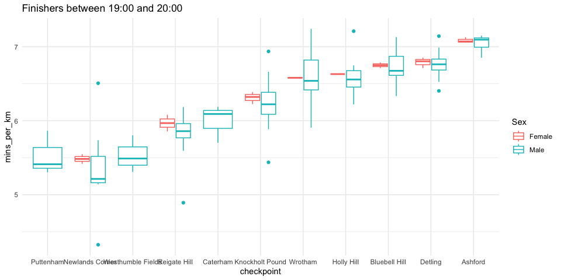
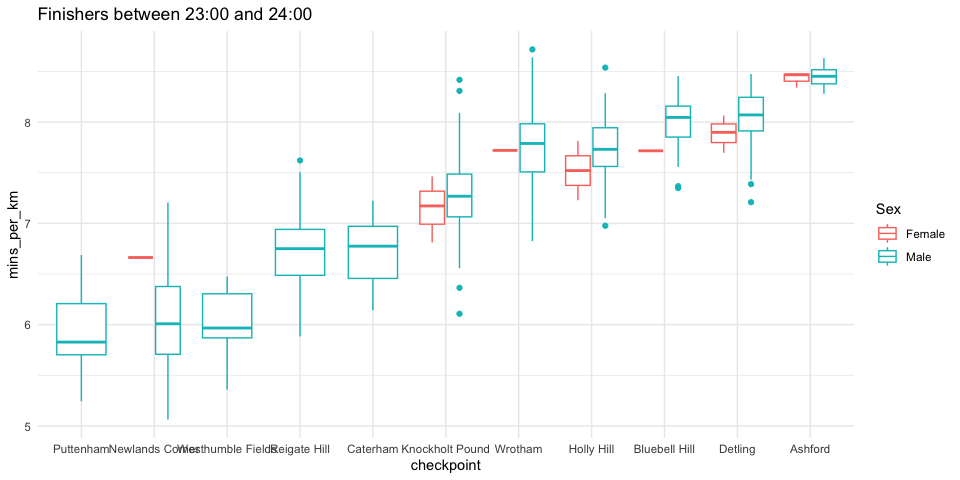
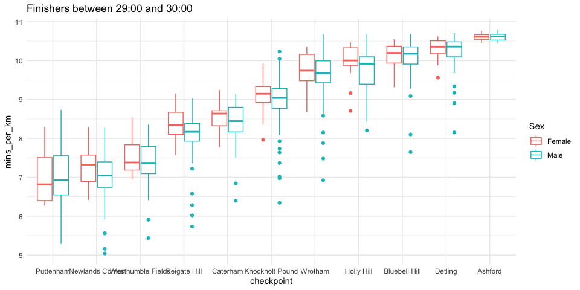

## North Downs Way 100

I’ve downloaded the NDW100 results since 2016 (the first year the final
checkpoint is marked as Ashford) and looked at the average, min and max
times each finisher went through each checkpoint. Runners who DNF’d are
excluded

Below show these stats, along with a boxplot of each checkpoint for
finishers between 19-20, 23-24 and 29-30 hours

### 19:00-20:00

    ## # A tibble: 11 × 6
    ## # Groups:   checkpoint, miles [11]
    ##    checkpoint        miles    km average_hms min_hms     max_hms                
    ##    <chr>             <dbl> <dbl> <Period>    <Period>    <Period>               
    ##  1 Puttenham           6.8  11.0 1H 0M 54S   58M 25S     1H 4M 35.9999999999995S
    ##  2 Newlands Corner    14.7  23.8 2H 7M 30S   1H 42M 59S  2H 34M 56S             
    ##  3 Westhumble Fields  24    38.9 3H 35M 6S   3H 26M 23S  3H 45M 36S             
    ##  4 Reigate Hill       31.8  51.5 5H 0M 24S   4H 12M 0S   5H 18M 36S             
    ##  5 Caterham           38    61.6 6H 8M 54S   5H 51M 0S   6H 20M 51S             
    ##  6 Knockholt Pound    50    81   8H 25M 48S  7H 20M 25S  9H 21M 48S             
    ##  7 Wrotham            60    97.2 10H 39M 6S  9H 33M 59S  11H 43M 50S            
    ##  8 Holly Hill         65.6 106.  11H 42M 6S  11H 1M 6S   12H 46M 10S            
    ##  9 Bluebell Hill      76.2 123.  13H 48M 18S 13H 1M 45S  14H 40M 11S            
    ## 10 Detling            82   133.  14H 59M 12S 14H 10M 33S 15H 48M 49S            
    ## 11 Ashford           103.  167.  19H 35M 12S 19H 1M 55S  19H 51M 43S

### 23:00-24:00

    ## # A tibble: 11 × 6
    ## # Groups:   checkpoint, miles [11]
    ##    checkpoint        miles    km average_hms min_hms     max_hms    
    ##    <chr>             <dbl> <dbl> <Period>    <Period>    <Period>   
    ##  1 Puttenham           6.8  11.0 1H 5M 30S   57M 46S     1H 13M 40S 
    ##  2 Newlands Corner    14.7  23.8 2H 24M 0S   2H 0M 35S   2H 51M 35S 
    ##  3 Westhumble Fields  24    38.9 3H 54M 12S  3H 28M 20S  4H 11M 45S 
    ##  4 Reigate Hill       31.8  51.5 5H 45M 12S  5H 3M 7S    6H 32M 36S 
    ##  5 Caterham           38    61.6 6H 55M 6S   6H 18M 6S   7H 24M 42S 
    ##  6 Knockholt Pound    50    81   9H 49M 18S  8H 14M 44S  11H 21M 48S
    ##  7 Wrotham            60    97.2 12H 33M 12S 11H 3M 20S  14H 7M 20S 
    ##  8 Holly Hill         65.6 106.  13H 41M 42S 12H 21M 26S 15H 7M 20S 
    ##  9 Bluebell Hill      76.2 123.  16H 27M 36S 15H 7M 10S  17H 23M 33S
    ## 10 Detling            82   133.  17H 49M 18S 15H 57M 40S 18H 45M 40S
    ## 11 Ashford           103.  167.  23H 28M 54S 23H 0M 13S  23H 58M 42S

### 29:00-30:00

    ## # A tibble: 11 × 6
    ## # Groups:   checkpoint, miles [11]
    ##    checkpoint   miles    km average_hms   min_hms                  max_hms      
    ##    <chr>        <dbl> <dbl> <Period>      <Period>                 <Period>     
    ##  1 Puttenham      6.8  11.0 1H 17M 30S    58M 15S                  1H 36M 14S   
    ##  2 Newlands Co…  14.7  23.8 2H 49M 18S    2H 0M 4S                 3H 17M 21S   
    ##  3 Westhumble …  24    38.9 4H 48M 12S    3H 31M 25S               5H 32M 3S    
    ##  4 Reigate Hill  31.8  51.5 7H 0M 18S     4H 55M 20S               7H 51M 32S   
    ##  5 Caterham      38    61.6 8H 38M 24S    6H 33M 53S               9H 29M 4S    
    ##  6 Knockholt P…  50    81   12H 10M 12S   8H 33M 51S               13H 48M 55S  
    ##  7 Wrotham       60    97.2 15H 37M 48S   11H 12M 50S              17H 18M 1S   
    ##  8 Holly Hill    65.6 106.  17H 23M 42S   14H 31M 48S              18H 54M 32S  
    ##  9 Bluebell Hi…  76.2 123.  20H 43M 36S   15H 44M 8S               21H 59M 26S  
    ## 10 Detling       82   133.  22H 43M 36S   18H 2M 54.0000000000073S 23H 42M 1S   
    ## 11 Ashford      103.  167.  1d 5H 27M 30S 1d 5H 0M 34S             1d 5H 58M 45S

